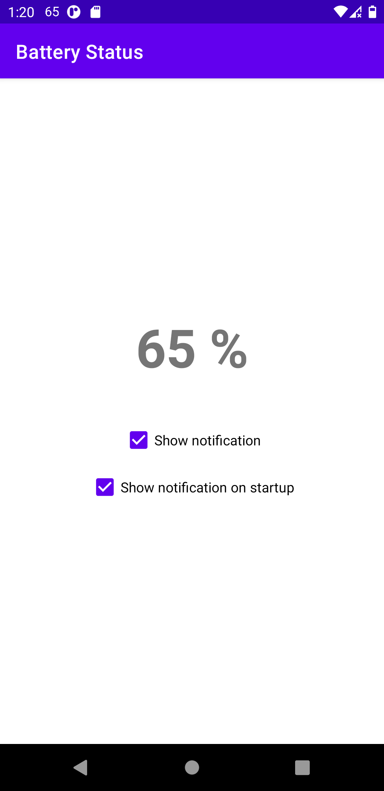
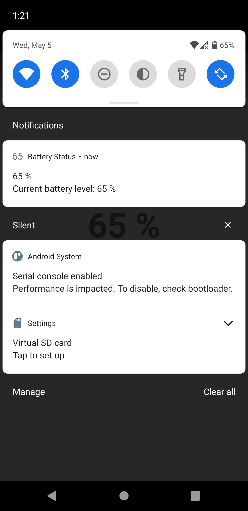

# Battery Status
**Battery Status** is a simple Android app intended mainly for showing the battery percentage in the notification section of the status bar. This can be useful, for example, on devices with wider notches, where it's impossible to fit the battery percentage to the right side of the status bar.

In addition, the app can show the battery percentage notification on startup, if the user wishes so.

## Screenshots

## Licensing
This project is licensed under the 3-clause BSD license. See the [LICENSE](LICENSE) file for details.

Written by [Vít Labuda](https://vitlabuda.cz/).
